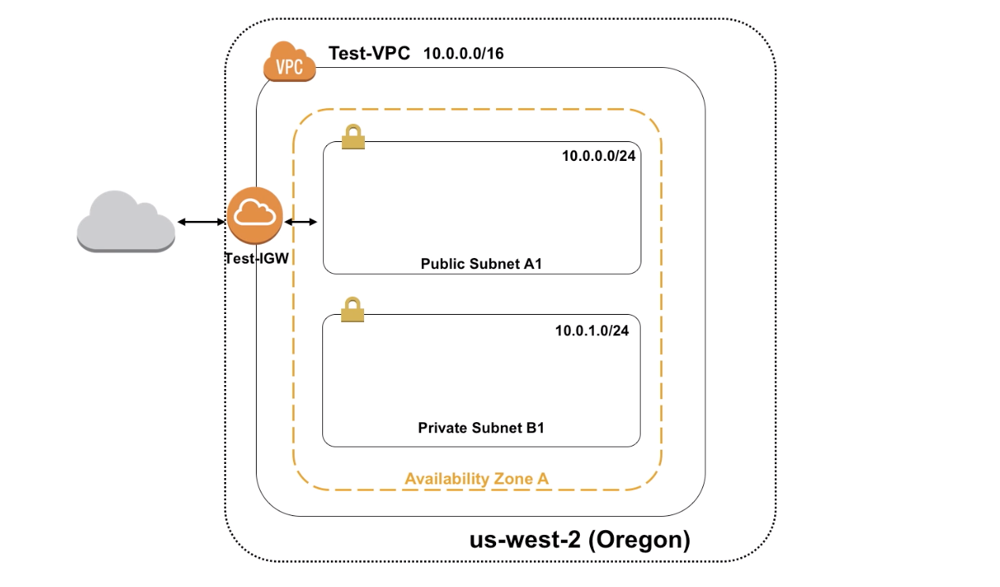

# Amazon Virtual Private Cloud (VPC)

* The **AWS Cloud** offers *pay-as-you-go*, *on demand compute*, as well as managed services all accessible via the web
* These compute resources and services must be accessible via normal IP protocols and implemented with familiar network structure
* Customers need to adhere to networking best practices as well as meet regulatory and organizational requirements
* **Amazon Virtual Private Cloud** (Amazon VPC) is the networking AWS Service that will meet our networking requirements
* Amazon VPC allows us to create a *private network* in the AWS Cloud while using the *same concepts as on premise networking*, all while *abstracting much of the complexity*, without sacrificing *control*, *usability*, and *security*.
* Allows complete control of network configuration
  * configs: *IP Address bases*, ***subnets***, and ***routing tables***
  * Control what you expose to the Internet and what you isolate to the Amazon VPC
* You can deploy your VPC in a way to layer security controls in the network
  * Isolating subnets
  * Defining access controls and lists
  * Customizing routing tables
  * Complete control over when to allow both incoming and outgoing traffic
* Other AWS Services that deploy into your VPC inherit and take advantage of the security that you build into your cloud network
* AWS VPC is a foundational service and integrates with numerous AWS Services

> ##### Services AWS VPCs can integrate with
>
> * AWS EC2
> * AWS OpsWork
> * Amazon S3
> * Amazon EMR
> * Amazon EFS
> * Amazon DynamoDB
> * Amazon RDS
> * AWS Elastic Beanstalk
> * Amazon ElastiCache
> * Amazon Workspaces
> * Amazon Route 53
> * Elastic Load Balancing
> * AWS Data Pipeline

* Understanding and implementing Amazon VPC will allow you to fully use other AWS Services

### AWS VPC Features

* AWS VPC builds upon the **AWS Global Infrastructure** of **AWS Regions** and **AWS Availability Zones** (AZs)
* This allows us to easily take advantage of the high availability provided by the AWS Cloud
* AWS VPCs live within AWS Regions and can span across multiple AWS Availability Zones (AZs)
* Each AWS account can create multiple VPCs that can be used to segregate environments
* VPCs define the IP address space that is then divided by the subnets
* Subnets are then deployed within Availability Zones, causing the VPC to span the Availability Zones
* You can create many subnets in a VPC, though fewer are recommended to reduce complexity of the network topology
* You can configure route tables for subnets to control the traffic between subnets and the Internet
* By default, all subnets within a VPC can communicate with each other
* Subnets are generally classified as public or private
  * **Public Subnets**: Direct access to the Internet
  * **Private Subnets**: No direct access to the Internet
* For a subnet to be public, we need to attach an **Internet Gateway** to the VPC and update the route table of the public subnet to send non-local traffic to the Internet Gateway
* **EC2 Instances** need a public IP address to route to an Internet Gateway

